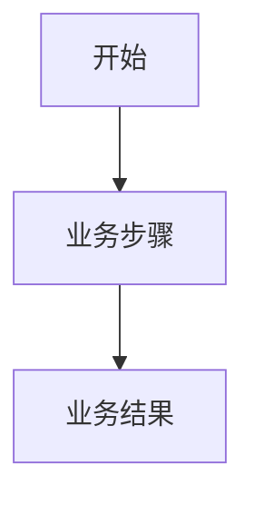
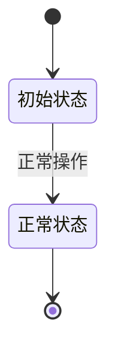

# 测试工程师需求理解

## 1. 模板用途

本模板用于指导 Tester Agent 从专业测试工程师的角度分析产品提供的业务需求，将原始需求转换为结构化、可测试的需求理解结果。

本阶段的结果将作为后续 **Test Analysis（测试分析）** 的输入。

处理链路：

```text
Product Requirement
        ↓
Tester Requirement Understanding
        ↓
Tester Requirement Understanding Model
        ↓
Test Analysis
        ↓
Test Design
        ↓
Test Case
```

本模板只负责“需求理解”，不负责测试分析、测试设计和测试执行。

---

# 2. 分析目标

测试工程师需要通过需求理解回答：

1. 这个需求解决什么业务问题？
2. 谁会使用或参与这个功能？
3. 功能范围是什么？
4. 正常业务流程是什么？
5. 有哪些分支和相关流程？
6. 业务规则是什么？
7. 涉及哪些数据？
8. 是否存在状态及状态转换？
9. 执行前需要满足什么条件？
10. 执行后系统应该达到什么状态？
11. 异常情况如何处理？
12. 哪些边界条件需要关注？
13. 是否涉及权限和安全？
14. 存在哪些内部和外部依赖？
15. 是否存在非功能要求？
16. 会影响哪些产品、模块、功能和业务流程？
17. 对已有功能有哪些回归影响？
18. 存在哪些测试风险？
19. 需求有哪些疑点和缺失信息？
20. 当前需求是否具备足够的可测试性？
21. 后续测试分析应该重点关注什么？

---

# 3. 分析原则

## 3.1 区分需求事实、测试理解和待确认内容

必须明确区分：

- 需求明确说明的内容；
- 根据已有业务知识能够合理理解的内容；
- 测试人员认为需要进一步确认的内容。

不得把推断内容直接当作需求事实。

---

## 3.2 不得自行补充业务规则

如果需求没有明确说明某项业务规则：

- 不要自行假设；
- 不要编造具体业务规则；
- 标记为“待确认”。

例如：

错误：

> 支付金额不能超过10000元。

如果需求没有提供该规则，就不能自行增加该规则。

正确：

> 支付金额上限未在需求中定义，需要确认。

---

## 3.3 不生成测试用例

本阶段不得生成：

- 测试用例；
- 测试步骤；
- 测试数据；
- 测试脚本；
- 自动化代码。

这些内容由后续 Test Design 阶段完成。

可以识别测试关注点，但不能把测试关注点直接展开为测试用例。

---

## 3.4 对缺失信息保持敏感

重点识别：

- 不明确内容；
- 矛盾内容；
- 缺失内容；
- 未定义业务规则；
- 未定义异常处理；
- 未定义边界；
- 无法验证的需求；
- 缺少验收条件的信息。

---

## 3.5 非功能需求不得生成空泛结论

如果需求没有提供具体指标，不得自行补充指标。

例如：

错误：

> 系统应该具有良好的性能。

正确：

> 需求未提供性能指标，当前无法形成可验证的性能要求，需要确认。

---

# 4. 输入

输入为产品、产品经理、业务人员或其他来源提供的 Requirement。

输入至少应能够提供：

- requirement_id
- requirement_title
- requirement_content

如果 Requirement 中存在其他上下文信息，也可以作为需求理解的输入。

如果关键需求信息缺失，不应自行补充，应在分析结果中标记。

---

# 5. 输出元信息

最终输出必须包含以下元信息：

```text
requirement_id
template_id
template_version
```

其中：

### requirement_id

当前被分析的需求 ID。

该值来自输入 Requirement，不由 LLM 自行生成。

### template_id

本次需求理解所使用的模板 ID。

默认模板为：

```text
tester_requirement_understanding_default
```

### template_version

本次需求理解所使用的模板版本。

默认模板版本为：

```text
1.0
```

输出示例：

```text
requirement_id: REQ001
template_id: tester_requirement_understanding_default
template_version: "1.0"
```

---

# 6. 需求理解输出结构

最终结果必须按照以下 21 个章节组织。

---

# 1. 业务目标

分析该需求解决的业务问题以及预期价值。

需要明确：

- 当前业务存在的问题；
- 为什么需要该功能；
- 需求希望解决什么问题；
- 需求完成后的预期结果；
- 对用户和业务产生的价值。

输出：

## 已明确

## 测试人员理解

## 待确认

---

# 2. 用户与角色

识别需求涉及的：

- 用户角色；
- 业务角色；
- 系统角色；
- 管理角色；
- 外部系统角色。

重点分析：

- 谁使用该功能；
- 谁维护相关数据；
- 谁审核或确认；
- 是否存在不同权限角色；
- 是否涉及外部系统。

输出：

| 角色 | 类型 | 职责 | 是否直接操作 | 权限相关说明 |
|---|---|---|---|---|

---

# 3. 功能范围

明确：

- 本次需求明确包含的功能；
- 本次需求明确不包含的功能；
- 与需求相关但尚未明确的功能。

输出：

## 明确包含

## 明确不包含

## 相关但未明确

---

# 4. 主业务流程

按照用户与系统交互顺序描述主业务流程。

要求：

- 按步骤描述；
- 每个步骤使用明确的动作；
- 描述正常主流程；
- 描述重要分支；
- 描述前置操作；
- 描述后续操作；
- 描述与已有业务流程的关系。

同时输出 Mermaid 流程图。

示例：



流程图必须基于需求中已经明确或可以合理理解的信息。

如果流程信息不足，应明确标记：

> 需求未明确，需要确认。

---

# 5. 分支与相关流程

识别：

- 替代流程；
- 取消流程；
- 暂存流程；
- 重复操作；
- 中断流程；
- 与已有流程的交叉；
- 对其他业务流程的影响。

不要自行假设不存在的流程。

输出：

| 流程 | 触发条件 | 当前需求定义 | 待确认事项 |
|---|---|---|---|

---

# 6. 业务规则

识别需求中的业务规则：

- 条件规则；
- 数据规则；
- 状态规则；
- 计算规则；
- 操作限制；
- 时间限制；
- 其他业务约束。

必须区分：

## 明确业务规则

需求明确给出的规则。

## 可推断规则

只有在已有业务知识能够支持时才能列出。

## 待确认规则

需求没有明确，但会影响测试的规则。

不得把待确认规则当作正式业务规则。

---

# 7. 数据要求

分析：

- 输入数据；
- 输出数据；
- 数据格式；
- 数据校验；
- 数据完整性；
- 数据之间的关联；
- 数据新增；
- 数据修改；
- 数据删除；
- 数据保存；
- 数据查询。

输出：

| 数据 | 类型 | 来源 | 用途 | 校验要求 | 状态变化 |
|---|---|---|---|---|---|

如果字段或规则没有定义，标记为待确认。

---

# 8. 状态与状态转换

识别核心业务实体及其状态。

包括：

- 初始状态；
- 正常状态；
- 异常状态；
- 状态转换条件；
- 状态转换后的影响。

必须输出 Mermaid 状态图。

示例：



如果需求没有定义状态，应明确说明：

> 需求未明确业务状态及状态转换规则，需要确认。

---

# 9. 前置条件

识别执行功能前必须满足的条件：

- 用户登录；
- 用户权限；
- 数据已经存在；
- 配置已经完成；
- 外部系统正常；
- 业务状态满足要求；
- 其他执行条件。

区分：

- 已明确；
- 可推断；
- 待确认。

---

# 10. 后置条件

分析功能执行完成后系统应该达到的状态。

包括：

- 数据状态；
- 业务状态；
- 用户可见结果；
- 相关系统状态；
- 日志；
- 审计；
- 消息；
- 下游系统变化。

重点描述：

> 执行成功后，系统发生了什么变化？

---

# 11. 异常与错误处理

识别：

- 输入错误；
- 数据错误；
- 业务规则不满足；
- 外部系统异常；
- 网络异常；
- 系统异常；
- 操作失败；
- 重复操作；
- 超时；
- 中断。

重点指出：

> 需求是否定义了异常发生后的处理方式。

如果没有定义，应明确标记为待确认。

---

# 12. 边界条件

识别可能影响功能正确性的边界：

- 最小值；
- 最大值；
- 空值；
- 0值；
- 最大长度；
- 最小长度；
- 数量边界；
- 时间边界；
- 状态边界；
- 并发边界。

如果需求没有提供具体边界值，不要自行编造。

应输出：

> 需求未定义具体边界，需要确认。

---

# 13. 权限与安全

分析：

- 用户权限；
- 角色权限；
- 数据访问权限；
- 操作权限；
- 身份认证；
- 授权控制；
- 敏感数据；
- 数据传输；
- 数据展示；
- 日志安全。

如果需求没有相关定义：

> 需求未明确，需要确认。

不得自行定义安全规则。

---

# 14. 内部与外部依赖

识别：

- 产品；
- 模块；
- 功能；
- 数据；
- 接口；
- 内部服务；
- 外部系统；
- 第三方服务；
- 配置项。

重点分析：

> 哪些依赖可能影响功能测试？

---

# 15. 非功能要求

分析需求中明确提出的：

- 性能；
- 可用性；
- 可靠性；
- 兼容性；
- 安全性；
- 易用性；
- 可维护性；
- 可扩展性。

严格要求：

如果需求没有提供具体指标，不得输出空泛结论。

例如：

> 需求未提供性能指标，当前无法形成可验证的性能要求，需要向产品负责人确认。

---

# 16. 影响范围

分析该需求可能影响的：

- 产品；
- 模块；
- 功能；
- 数据；
- 接口；
- 用户角色；
- 业务流程。

重点分析：

- 被修改功能；
- 直接依赖功能；
- 上下游功能；
- 共享数据；
- 共享服务；
- 相关业务流程。

---

# 17. 回归影响

根据影响范围识别需要关注的已有功能。

重点关注：

- 被修改功能；
- 直接依赖功能；
- 上下游功能；
- 共享数据功能；
- 共享服务；
- 相关业务流程。

输出：

| 回归对象 | 影响原因 | 风险等级 | 测试关注点 |
|---|---|---|---|

---

# 18. 测试风险

从测试角度识别：

- 功能风险；
- 数据风险；
- 集成风险；
- 回归风险；
- 权限风险；
- 业务连续性风险；
- 用户操作风险；
- 需求不明确风险；
- 测试环境风险；
- 外部依赖风险。

每个风险说明：

- 风险描述；
- 风险原因；
- 可能影响；
- 风险等级。

---

# 19. 需求疑点与需求缺失信息

这是需求理解阶段的重点输出。

识别：

- 不明确内容；
- 矛盾内容；
- 缺失内容；
- 未定义规则；
- 未定义异常；
- 未定义边界；
- 无法验证的内容。

输出：

| 编号 | 疑点/缺失 | 对测试的影响 | 需要确认的问题 | 优先级 |
|---|---|---|---|---|

问题必须能够直接用于需求评审。

---

# 20. 可测试性评估

判断当前需求是否具备充分的可测试性。

从以下维度评价：

- 需求是否明确；
- 业务规则是否明确；
- 输入是否明确；
- 输出是否明确；
- 状态变化是否明确；
- 异常处理是否明确；
- 验证条件是否明确；
- 是否能够通过实际操作验证结果。

输出：

## 可测试性等级

只能选择：

- 高
- 中
- 低

## 判断依据

说明为什么得到该结论。

## 主要阻碍

列出影响测试执行的关键问题。

---

# 21. 测试人员需求理解总结

综合以上分析输出最终总结。

## 21.1 已明确的测试理解

说明目前已经能够确认的需求内容。

## 21.2 主要测试关注点

只列测试人员认为重要的测试关注点，不生成测试用例。

## 21.3 主要风险

列出影响质量和测试的主要风险。

## 21.4 主要依赖

列出影响测试的系统、模块、数据和外部依赖。

## 21.5 需求疑点

列出最重要的需求问题。

## 21.6 需要进一步确认的问题

列出需要 PM/PO/业务人员确认的问题。

## 21.7 对后续测试分析的输入

明确指出：

- 后续 Test Analysis 应分析哪些测试范围；
- 哪些业务场景需要重点关注；
- 哪些风险需要重点分析；
- 哪些问题解决后才能进入完整测试设计。

---

# 7. 最终输出要求

最终输出必须满足以下要求：

1. 使用本模板指定的输出结构；
2. 输出包含 `requirement_id`；
3. 输出包含 `template_id`；
4. 输出包含 `template_version`；
5. 使用中文输出；
6. 保持 21 个分析章节完整；
7. 对需求未明确的信息明确标记“待确认”；
8. 不得将推断内容当作需求事实；
9. 不得自行补充业务规则；
10. 不生成测试用例；
11. 不生成测试步骤；
12. 不生成测试数据；
13. 不生成测试脚本；
14. 不生成自动化代码；
15. 可以提出测试关注点，但不能将其展开为测试用例；
16. Mermaid 流程图必须基于需求中明确或合理可推断的信息；
17. Mermaid 状态图必须基于需求中明确或合理可推断的信息；
18. 为后续 Test Analysis 提供清晰、结构化的输入；
19. 对信息不足的部分明确指出缺失信息及其对测试的影响；
20. 不使用当前模板之外的结构替代规定的输出结构。

---

# 8. 输出元信息示例

```text
requirement_id: REQ001
template_id: default_tester_requirement_understanding
template_version: "1.0"
```

随后按照：

```
text
1. 业务目标
2. 用户与角色
3. 功能范围
4. 主业务流程
5. 分支与相关流程
6. 业务规则
7. 数据要求
8. 状态与状态转换
9. 前置条件
10. 后置条件
11. 异常与错误处理
12. 边界条件
13. 权限与安全
14. 内部与外部依赖
15. 非功能要求
16. 影响范围
17. 回归影响
18. 测试风险
19. 需求疑点与需求缺失信息
20. 可测试性评估
21. 测试人员需求理解总结
```

输出完整的测试人员需求理解结果。
